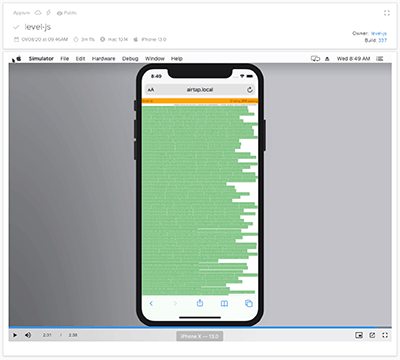

# airtap

> Test your JavaScript in 800+ browsers.

[](https://www.npmjs.org/package/airtap)
[](https://www.npmjs.org/package/airtap)
[](https://travis-ci.org/airtap/airtap)
[](https://david-dm.org/airtap/airtap)

Airtap is an easy way to test your JavaScript in browsers, using a TAP-producing harness like `tap` or `tape`. Start testing your code locally in seconds and seamlessly move to cloud based browsers powered by [Sauce Labs](https://saucelabs.com/) for better coverage.

Airtap is different than other cross browser test runners in its simplicity and ability to easily run your test suite in many browsers without having them installed locally. It lets you iterate quickly during development and provide good browser coverage before release without worrying about missing a supported browser.

Don't just claim your JavaScript supports "all browsers", prove it with tests!

_This project is a fork of the amazing [Zuul](https://github.com/defunctzombie/zuul). Please note that some documentation may be out of date. Anyone is welcome and encouraged to contribute via a pull request._

## Install

With [npm](https://npmjs.org) do:

```
npm install airtap --save-dev
```

If you are upgrading or migrating from [Zuul](https://github.com/defunctzombie/zuul): please see the [upgrade guide](./UPGRADING.md).

## Workflow

Airtap works out of the box with `tap` and `tape`. If you're already using these, setup will be trivial.

Airtap has 3 modes of operation: locally, cloud browsers, and continuous integration. You should make sure that airtap is working locally before you try to run the other two.

Airtap will do all the hard work of setting up your test harness, support files, and cloud browser integration so you can just focus on writing your tests.

### Running locally

All you need is an entry point for your tests like `test.js`. When iterating on your tests during development, simply use `--local` mode to see your tests run in a browser.

See the included [example](./example) for a simple test. Run it by issuing the following command in the example directory:

```
airtap --local test.js
```

It will print a URL that you can open in any local browser to run the tests. Make changes to the code as needed. No need to restart airtap, just refresh your browser.


### Cross browser testing via Sauce Labs

The reason we go through all this trouble in the first place is to seamlessly run our tests against all those browsers we don't have installed. Luckily, [Sauce Labs](https://saucelabs.com/) runs quite a few browsers and we can easily task airtap to test on those.

See the [Cloud Testing](./doc/cloud-testing.md) guide to get your tests running in the cloud. TLDR: [save your credentials to `~/.airtaprc`](./doc/airtaprc.md), [add browsers to `.airtap.yml`](./doc/airtap.yml.md) and issue:

```
airtap test.js
```



### Continuous Integration

No testing setup would be complete without a badge for passing or failing tests. After making sure your tests all pass in the cloud from your local machine, we will configure our tests to pass from Travis when we commit changes. See the [Travis CI](./doc/travis-ci.md) guide.

[](https://saucelabs.com/u/level-js)

## Who Uses Airtap?

**Lots of folks!** Collectively, packages that depend on Airtap get 100's of millions of downloads per month!

- [`level`](https://github.com/Level/level) (and dependencies)
- [`webtorrent`](https://github.com/webtorrent/webtorrent) (and dependencies)
- [`simple-peer`](https://github.com/feross/simple-peer)
- [`buffer`](https://github.com/feross/buffer)
- [`stream-http`](https://github.com/jhiesey/stream-http)
- [`readable-stream`](https://github.com/nodejs/readable-stream)
- _Send a PR to add your package to the list!_

## Contributing

Airtap is an **OPEN Open Source Project**. This means that:

> Individuals making significant and valuable contributions are given commit-access to the project to contribute as they see fit. This project is more like an open wiki than a standard guarded open source project.

See the [contribution guide](CONTRIBUTING.md) for more details.

## Configuration

Airtap consumes a YAML config file. See the [airtap.yml](./doc/airtap.yml.md) guide for all of the goodies this file provides.

It includes advanced usage like how to run an additional server to support tests that make ajax requests.

## Big Thanks

Cross-browser Testing Platform and Open Source ♥ Provided by [Sauce Labs](https://saucelabs.com).

[](https://saucelabs.com)

## License

MIT © [Roman Shtylman](https://github.com/defunctzombie), [Zuul contributors](https://github.com/defunctzombie/zuul/graphs/contributors) and [Airtap contributors](https://github.com/airtap).
